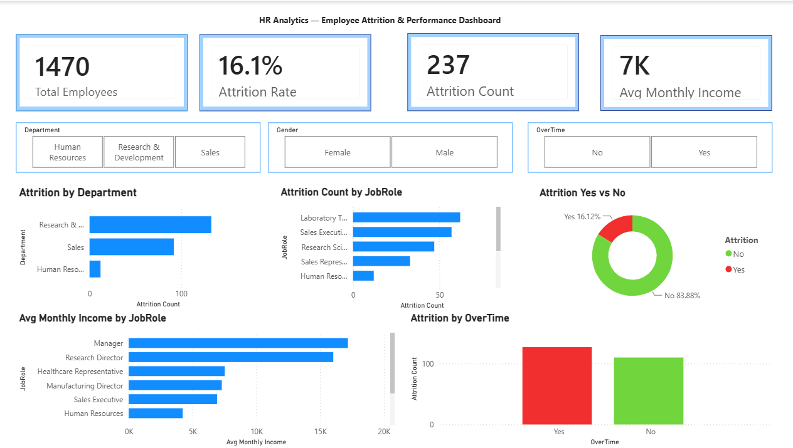

# HR Analytics — Employee Attrition & Performance

## 📌 Project Overview
Analysed employee attrition and performance data to identify 
key factors driving employee turnover using Power BI.

## 🛠️ Tools Used
- Power BI (Data Modelling, DAX, Dashboard)
- Dataset:  HR Analytics (Kaggle)

## 📊 Dashboard Preview

## 🔍 Key Findings
- Analysed attrition patterns across departments and job roles
- Identified key drivers of employee turnover
- Built interactive dashboard with drill-down filters

## 📁 Files
| File | Description |
|------|-------------|
| HR_Analytics_Dashboard.pbix | Power BI dashboard file |
| dashboard.png | Dashboard screenshot |

## 👤 Author
**Harsh Solanki** — [LinkedIn](# HR Analytics — Employee Attrition & Performance

## 📌 Project Overview
Analysed employee attrition and performance data to identify 
key factors driving employee turnover using Power BI.

## 🛠️ Tools Used
- Power BI (Data Modelling, DAX, Dashboard)
- Dataset: IBM HR Analytics (Kaggle)

## 📊 Dashboard Preview

## 🔍 Key Findings
- Analysed attrition patterns across departments and job roles
- Identified key drivers of employee turnover
- Built interactive dashboard with drill-down filters

## 📁 Files
| File | Description |
|------|-------------|
| HR_Analytics_Dashboard.pbix | Power BI dashboard file |
| dashboard.png | Dashboard screenshot |

## 👤 Author
**Harsh Solanki** — [LinkedIn](https://www.linkedin.com/in/harsh-solanki-545987248?utm_source=share_via&utm_content=profile&utm_medium=member_ios)
